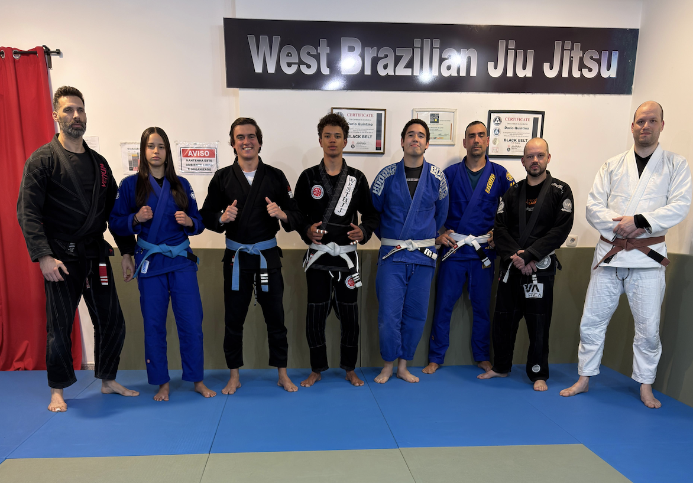
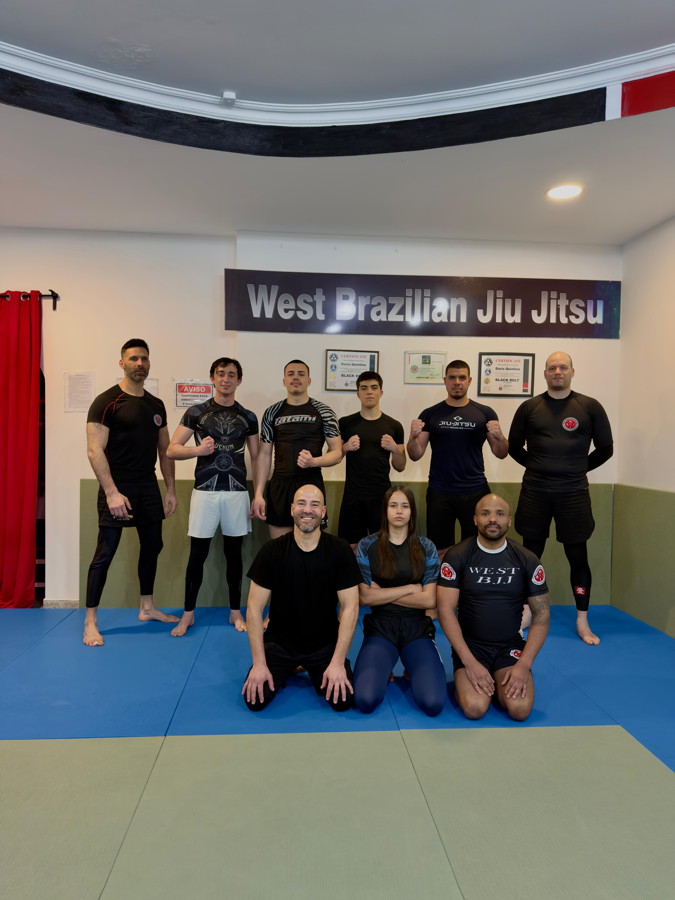

<html lang="pt-PT">
<head>
<meta charset="UTF-8">
<meta name="viewport" content="width=device-width, initial-scale=1.0">
<title>West Brazilian Jiu-Jitsu – Malveira</title>
<link href="https://fonts.googleapis.com/css2?family=Anton&family=Bebas+Neue&family=Barlow+Condensed:ital,wght@0,300;0,400;0,600;0,700;1,400&family=Barlow:wght@300;400;500;600&display=swap" rel="stylesheet">

</head>
<body>

<!-- NAV -->
<nav id="navbar">
  <a href="#" class="nav-logo">
    
    

      <strong>West BJJ</strong>
      <small>Malveira · Portugal</small>
    

  </a>
  <ul class="nav-links">
    <li><a href="#sobre">Academia</a></li>
    <li><a href="#horarios">Horários</a></li>
    <li><a href="#instrutores">Instrutores</a></li>
    <li><a href="#treinos">Treinos</a></li>
    <li><a href="#contacto">Contacto</a></li>
    <li><a href="https://www.instagram.com/westbjj.malveira" target="_blank" class="nav-cta">📸 Instagram</a></li>
  </ul>
</nav>

<!-- HERO -->
<section id="hero">
  

  

  

    
Malveira · Mafra · Portugal

    
    <h1 class="hero-title">West Brazilian Jiu&#8209;Jitsu</h1>
    
Disciplina. Respeito. Arte marcial para toda a família.

    

      <a href="https://www.instagram.com/westbjj.malveira" target="_blank" class="btn-red">📸 Seguir no Instagram</a>
      <a href="#horarios" class="btn-ghost">Ver Horários</a>
    

  

</section>

<!-- STATS BAR -->

  

BJJ

Arte Suave Brasileira

  

No-Gi

Submission Wrestling

  

Kids

Programa Infantil

  

MMA

Artes Marciais Mistas

<!-- SOBRE -->
<section id="sobre">

  

    

      
      <svg style="display:none;" class="logo-big" viewBox="0 0 200 200" xmlns="http://www.w3.org/2000/svg">
        <circle cx="100" cy="100" r="96" fill="#C41E1E"/>
        <circle cx="100" cy="100" r="90" fill="none" stroke="white" stroke-width="2" stroke-dasharray="5 6"/>
        <circle cx="100" cy="100" r="74" fill="#1a1a1a"/>
        <line x1="44" y1="44" x2="156" y2="156" stroke="#C41E1E" stroke-width="5" stroke-linecap="round"/>
        <line x1="156" y1="44" x2="44" y2="156" stroke="#C41E1E" stroke-width="5" stroke-linecap="round"/>
        <text x="100" y="74" text-anchor="middle" font-family="Arial Black,sans-serif" font-size="28" fill="white" font-weight="900">W</text>
        <text x="63" y="115" text-anchor="middle" font-family="Arial Black,sans-serif" font-size="28" fill="white" font-weight="900">B</text>
        <text x="137" y="115" text-anchor="middle" font-family="Arial Black,sans-serif" font-size="28" fill="white" font-weight="900">J</text>
        <text x="100" y="150" text-anchor="middle" font-family="Arial Black,sans-serif" font-size="24" fill="white" font-weight="900">J</text>
        <path id="arc1" d="M 100,100 m -84,0 a 84,84 0 1,1 168,0" fill="none"/>
        <text font-family="Arial,sans-serif" font-size="11.5" fill="white" letter-spacing="5"><textPath href="#arc1" startOffset="5%">· WEST BRAZILIAN JIU JITSU ·</textPath></text>
        <path id="arc2" d="M 100,100 m -84,0 a 84,84 0 0,0 168,0" fill="none"/>
        <text font-family="Arial,sans-serif" font-size="10" fill="white" letter-spacing="4"><textPath href="#arc2" startOffset="10%">JIU JITSU &amp; SUBMISSION</textPath></text>
      </svg>
      
Arte Suave · Malveira

    

    

      
Sobre Nós

      <h2 class="stitle">Uma Academia. Uma Família.</h2>
      
A <strong>West Brazilian Jiu-Jitsu</strong> é uma academia dedicada ao ensino do BJJ em <strong>Malveira, Mafra</strong>. O nosso ambiente é acolhedor, seguro e focado no crescimento de cada atleta — do iniciante ao competidor.

      
Acreditamos que o Jiu-Jitsu é mais do que uma arte marcial — é uma ferramenta de <strong>autoconhecimento, disciplina e confiança</strong> que transforma vidas dentro e fora do tatame.

      
Com instrutores qualificados, acolhemos alunos de <strong>todas as idades e níveis</strong>: crianças, adultos, iniciantes e atletas de competição.

      <ul class="feat-list">
        <li>Crianças e adultos</li>
        <li>Instrutores certificados</li>
        <li>Ambiente familiar</li>
        <li>BJJ · No-Gi · MMA</li>
        <li>Competição e lazer</li>
        <li>Tatame moderno</li>
      </ul>
    

  

</section>

<!-- HORÁRIOS -->
<section id="horarios">

  
Grade Semanal

  <h2 class="stitle reveal">Horários</h2>
  
* Sujeito a alterações — confirme sempre com a academia

  

    <table class="grade">
      <thead>
        <tr>
          <th>Horário</th>
          <th>SEG</th>
          <th>TER</th>
          <th>QUA</th>
          <th>QUI</th>
          <th>SEX</th>
        </tr>
      </thead>
      <tbody>
        <tr>
          <td class="tc">10:30–12:00</td>
          <td class="c-nogi">
<b>NOGI</b>
</td>
          <td class="empty"></td>
          <td class="c-bjj">
<b>JIU JITSU</b>
</td>
          <td class="empty"></td>
          <td class="c-mma">
<b>MMA</b>
</td>
        </tr>
        <tr>
          <td class="tc">18:00–19:00</td>
          <td class="c-kidsav">
<b>KIDS</b><s>Avançados</s>
</td>
          <td class="c-kids">
<b>KIDS</b>
</td>
          <td class="c-kidsav">
<b>KIDS</b><s>Avançados</s>
</td>
          <td class="c-kids">
<b>KIDS</b>
</td>
          <td class="empty"></td>
        </tr>
        <tr>
          <td class="tc">19:00–20:30</td>
          <td class="c-bjjav">
<b>JIU JITSU</b><s>Avançados</s>
</td>
          <td class="empty"></td>
          <td class="c-bjjav">
<b>JIU JITSU</b><s>Avançados</s>
</td>
          <td class="empty"></td>
          <td class="c-nogi">
<b>NOGI</b>
</td>
        </tr>
        <tr>
          <td class="tc">19:30–20:30</td>
          <td class="empty"></td>
          <td class="c-init">
<b>JIU JITSU</b><s>Iniciados</s>
</td>
          <td class="empty"></td>
          <td class="c-init">
<b>JIU JITSU</b><s>Iniciados</s>
</td>
          <td class="empty"></td>
        </tr>
        <tr>
          <td class="tc">20:30–21:30</td>
          <td class="empty"></td>
          <td class="c-initm">
<b>JIU JITSU</b><s>Iniciados Intermédio</s>
</td>
          <td class="empty"></td>
          <td class="c-initm">
<b>JIU JITSU</b><s>Iniciados Intermédio</s>
</td>
          <td class="empty"></td>
        </tr>
      </tbody>
    </table>
  

  

    

BJJ / No-Gi / MMA

    

Kids

    

Iniciados

    

Iniciados Intermédio

  

</section>

<!-- INSTRUTORES -->
<section id="instrutores">

  
Quem nos lidera

  <h2 class="stitle reveal">Instrutores</h2>
  

    <!-- Dario Quintino -->
    

      
🥋

      <h3>Dario Quintino</h3>
      

        

          

          

          

          

          

          

          

        

      

      
Faixa Preta · 3º Grau · Mestre

      
Fundador e Mestre da West BJJ Malveira. Com décadas de dedicação à Arte Suave Brasileira, o Mestre Dario é o pilar da academia — referência técnica e humana de toda a equipa. Responsável pelos treinos de BJJ, No-Gi e MMA.

    

    <!-- Jhonathan Soares -->
    

      
🥋

      <h3>Jhonathan Soares</h3>
      

        

          

          

          

          

        

      

      
Professor · BJJ

      
Instrutor dedicado e técnico, o nosso faixa roxa, Professor Jhonathan, é responsável pelas aulas de <strong>Iniciados</strong> e dá apoio nos treinos de <strong>Kids</strong>, orientando os mais novos com entusiasmo e método.

      <a href="https://www.instagram.com/jhonathan_soaresbjj" target="_blank" class="inst-ig">📸 @jhonathan_soaresbjj</a>
    

  

</section>

<!-- TREINOS RECENTES -->
<section id="treinos">

  
Direto do Tatame

  <h2 class="stitle reveal">Treinos Recentes</h2>

  

    <!-- Treino 1 -->
    

      

        
        

          <svg width="44" height="44" viewBox="0 0 24 24" fill="none" stroke="white" stroke-width="1.5"><rect x="3" y="3" width="18" height="18" rx="2"/><circle cx="8.5" cy="8.5" r="1.5"/><polyline points="21,15 16,10 5,21"/></svg>
          imagem1.png
        

        BJJ Gi
      

      

        
<strong>Segunda-Feira</strong><em>·</em><em>19:00–20:30</em>

        <h3>Passagem de Guarda & Raspagens</h3>
        
Sessão focada em passagem de guarda fechada, half-guard e raspagens de base. Drilling intenso seguido de sparring técnico com o Mestre Dario.

      

    

    <!-- Treino 2 -->
    

      

        
        

          <svg width="44" height="44" viewBox="0 0 24 24" fill="none" stroke="white" stroke-width="1.5"><rect x="3" y="3" width="18" height="18" rx="2"/><circle cx="8.5" cy="8.5" r="1.5"/><polyline points="21,15 16,10 5,21"/></svg>
          imagem2.png
        

        Kids
      

      

        
<strong>Terça-Feira</strong><em>·</em><em>18:00–19:00</em>

        <h3>Kids – Quedas e Rolamentos</h3>
        
Os mais novos a trabalhar quedas seguras, rolamentos e posições de base com o Prof. Jhonathan. Muito entusiasmo e diversão no tatame!

      

    

    <!-- Treino 3 -->
    

      

        
        

          <svg width="44" height="44" viewBox="0 0 24 24" fill="none" stroke="white" stroke-width="1.5"><rect x="3" y="3" width="18" height="18" rx="2"/><circle cx="8.5" cy="8.5" r="1.5"/><polyline points="21,15 16,10 5,21"/></svg>
          imagem3.png
        

        No-Gi
      

      

        
<strong>Sexta-Feira</strong><em>·</em><em>19:00–20:30</em>

        <h3>No-Gi – Leg Locks & Rola</h3>
        
Sessão avançada de leg locks: Ashi Garami, heel hooks e defesas. Treino técnico com foco em controlo, posição e segurança de todos os atletas.

      

    

  

<!-- CONTACTO -->
<section id="contacto">

  

    
Encontra-nos

    <h2 class="stitle reveal">Contacto & Localização</h2>
    

      

        
📍

        

          <label>Morada</label>
          Malveira, Mafra Lisboa, Portugal
        

      

      

        
🕐

        

          <label>Funcionamento</label>
          Seg–Sex: 10:30–21:30 
        

      

      

        
📸

        

          <label>Instagram — Contacto principal</label>
          <a href="https://www.instagram.com/westbjj.malveira" target="_blank">@westbjj.malveira</a>
        

      

    

    <a href="https://www.instagram.com/westbjj.malveira" target="_blank" class="ig-cta reveal">📸 Fala Connosco no Instagram</a>
  

  

    

      <iframe
        src="https://www.google.com/maps/embed?pb=!1m18!1m12!1m3!1d3000!2d-9.2568793!3d38.9297704!2m3!1f0!2f0!3f0!3m2!1i1024!2i768!4f13.1!3m3!1m2!1s0xd1ed50e8e96aae1%3A0x7b420934480c43e0!2sWest%20Brazilian%20jiu%20Jitsu!5e0!3m2!1spt!2spt!4v1680000000000"
        allowfullscreen="" loading="lazy" referrerpolicy="no-referrer-when-downgrade">
      </iframe>
    

    <a href="https://maps.app.goo.gl/ALK3irVxhmGBbHma7" target="_blank" class="map-link">Abrir no Google Maps →</a>
  

</section>

<!-- CTA -->
<section id="cta">
  <h2>A tua primeira aula é grátis.</h2>
  
Junta-te à família West BJJ — crianças, adultos, iniciantes e competidores são bem-vindos.

  <a href="https://www.instagram.com/westbjj.malveira" target="_blank" class="btn-white">📸 Contactar no Instagram</a>
</section>

<!-- FOOTER -->
<footer>
  <a href="#" class="f-logo">
    
    WEST <em>BJJ</em> · Malveira
  </a>
  <small>© 2025 West Brazilian Jiu-Jitsu · Malveira, Mafra · Portugal</small>
  <small style="color:#333;">Arte Suave. Vida Real.</small>
</footer>

